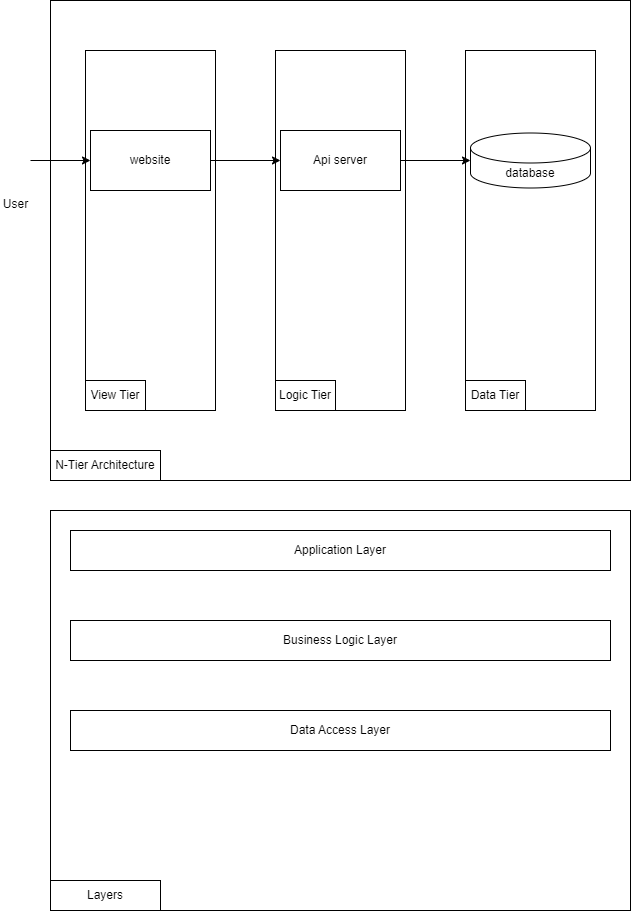

# Fitness Full Stack Workout Tracker

made with React and ASP.NET Core

## run the application

```
dotnet watch --project src/Fitness.Api/Fitness.Api.csproj run
```

### to create react app

```
npm install create-react-app
```

```
npx create-react-app fitnessfront --template typescript
```

#### What I've Learned

- [ ] Study and developed using a N Tier Architecture

#### Architecture diagram



### Design made with figma
- figma link url

### logo
Made with www.logomaker.com
#### font
Fugaz one

Photo by [Anastase Maragos](https://unsplash.com/@visualsbyroyalz?utm_content=creditCopyText&utm_medium=referral&utm_source=unsplash) on [Unsplash](https://unsplash.com/photos/topless-man-in-black-shorts-sitting-on-black-and-silver-barbell-9dzWZQWZMdE?utm_content=creditCopyText&utm_medium=referral&utm_source=unsplash)